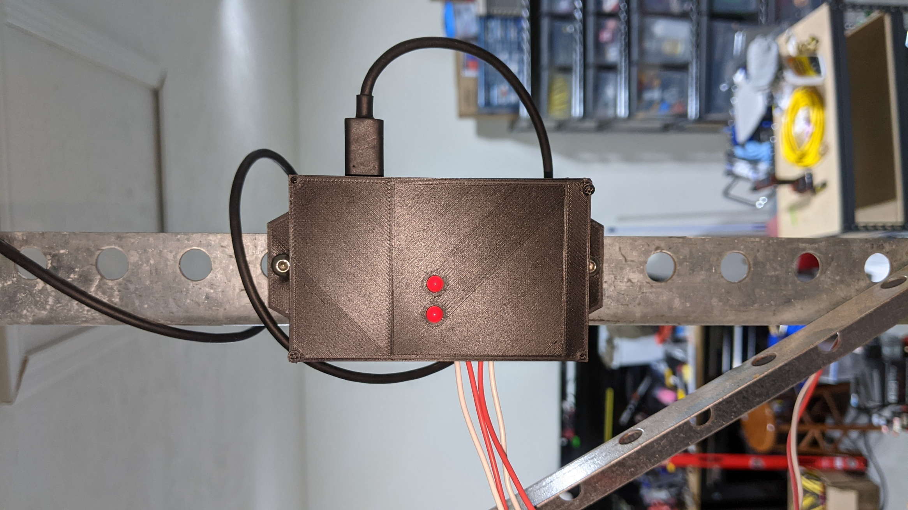
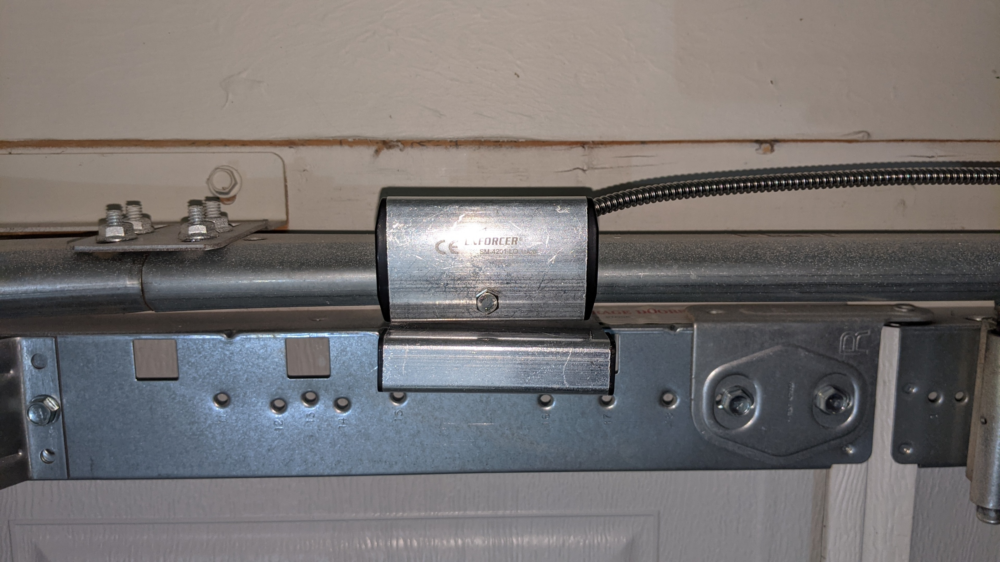

# ESP8266 2-Channel Relay
---
This project was originally designed to act a as wifi enabled IoT garage door opener. It has two relay channels and two sensor channels. 

This hardware is largely a rip off of standard "Arduino" modules that you can find on eBay and other sources. It's really nothing special. It does proivde a higher degree of integration as you can mount a NodeMCU directly to the PCB. 

I've tested this with the TASMOTA software and it seems to work pretty well. 

Here is the TASMOTA Config for the module. Any kind of Commands or Backlog things are left to the user.

GPIO -> Function
---
GPIO4 -> Relay2  
GPIO5 -> Relay1  
GPIO12 -> Switch2  
GPIO14 -> Switch1  

This project also includes FreeCAD files for a 3D printable box for the device. I used the following as the magnetic sensor, but any other one would work just fine:

[Seco-Larm Overhead Door Sensor](https://www.amazon.com/SECO-LARM-SM-4201-LQ-TRACK-MOUNT-OVERHEAD/dp/B011OXPZ7Y/ref=sr_1_16?crid=1GI1UTF3R9V3U&dchild=1&keywords=seco-larm+sm-226lq+overhead+door-mount+n.o.+magnetic+contact&qid=1628387442&sprefix=seco-larm+overhead+doo%2Caps%2C196&sr=8-16)

Here are a few pictures of the device and the sensor

